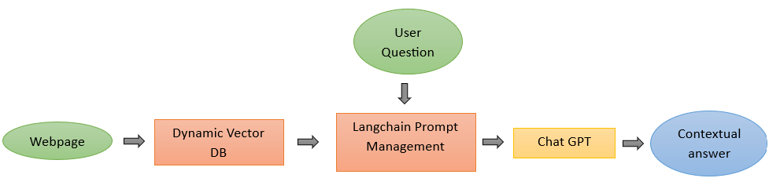
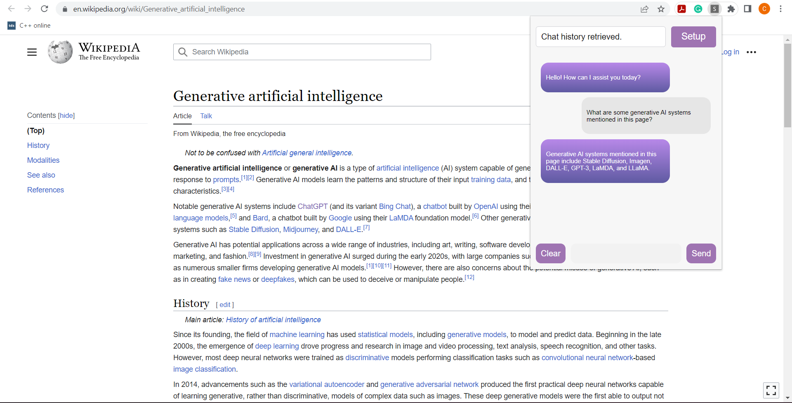

### Universal Chatbot: Enhancing Webpage Conversations with Real-time Knowledge

## Introduction
The Universal Chatbot is a powerful web extension designed to enhance your online conversations by augmenting them with real-time information from the webpages you're currently viewing. By leveraging the capabilities of a retriever augmented chatbot and advanced natural language processing techniques, this tool provides accurate and grounded responses tailored to the content of the active webpage.

## Architecture:
Here is the high level architecture of the system.



## Demo:
Here is a demo of the system.



## Features:
1. Webpage Scraping: Once installed, the web extension automatically scrapes the data from the current webpage, capturing relevant information that can be utilized during conversations.
2. Backend Server and Knowledge Base: The scraped data is sent to a backend server where the Langchain library is employed to break the information into chunks, generate embeddings, and construct a real-time knowledge base.
3. Augmented Questioning: When you pose a question while using the chatbot, the system augments your query with content from the active webpage, ensuring the response is contextually relevant and precise.
4. ChatGPT Integration: The augmented question is then forwarded to ChatGPT, a state-of-the-art language model, which processes the query and generates a response. The result you receive is a highly accurate and contextualized answer.

## Installation and Setup:
1. Extension Installation: You can install the Universal Chatbot extension from the extension manager tab in your browser. You have to enable developer mode, click 'load unpacked' and point it to the extension folder.
2. OpenAI Key: Login to the chatbot using your OpenAI API key, which is stored locally on your system, ensuring the privacy and security of your information.
3. Backend Server: Spin up the Node.js backend server provided, which serves as the bridge between the web extension and the chatbot's functionalities.
```cmd
npm run start
```
4. Chat Window: Simply click on the new extension icon, and a chat window will open, allowing you to engage in conversations enhanced by the Universal Chatbot.

By incorporating the Universal Chatbot into your browsing experience, you can benefit from more accurate and insightful responses during online discussions. This tool revolutionizes the way we interact with web content, enabling a seamless fusion of web knowledge and conversational AI
Disclaimer: this description was written with the help of ChatGPT
